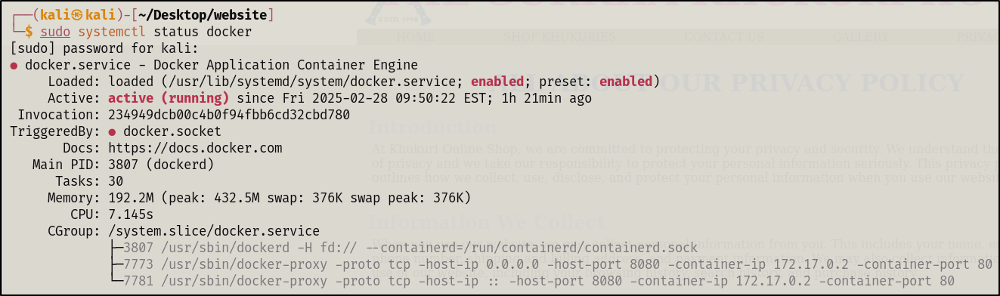
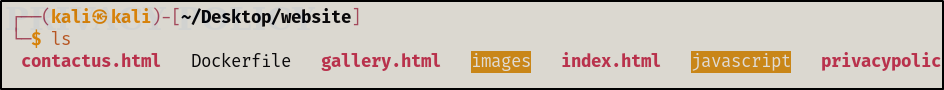
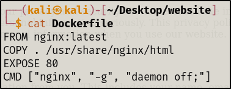
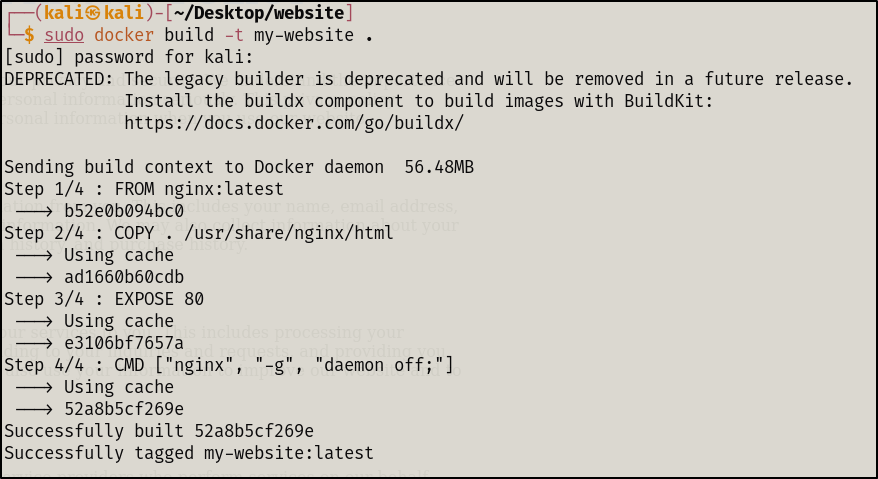
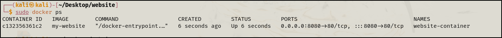

# host-static-site-docker
## Introduction

Hello everyone :) Hope you’re having a great day. 

If you’ve landed here, this writeup is entirely about Using docker and nginx to host the static website locally. I’ll try my best to make it interesting and informative. 

When I was exploring different concepts in Operating system I came across something interesting Called Docker. It sparked my curiosity, that curiosity lead to knowing that we can host an entire website using Docker Containers instead of running a full Ubuntu server VM, which can consume a lot of system resources. Docker provides a lightweight, CLI-based service that make a deployment easy. 

As I wanted to focus on learning Docker and hosting a web server with docker and Nginx, the website I am using is a static website that I built as a semester 2: module “internet technologies” final assignment. 

Now let’s see how we can implement the overall procedure and host the website locally. 

## Step 1: Installing Docker on kali linux

Since my host machine is kali Linux, we first need to install Docker. using the following commands,

```bash
sudo apt install #updates the package list from repospitoris
sudo apt install -y docker.io #installs docker
sudo systemctlenable --now docker #enables and starts dockers service 

```

After the above procedure is completed you can check the docker status as shown in the screen shot. 



If the service is active and running we are fine to move on.

 

## Step 2: Setting up Nginx in Docker

Docker is a service where we can run different prebuilt container for different purposes such as web hosting, databases and application services. where nginx is one of them a lightweight and high-performance web server. We will be using Nginx to host our website locally cause it is fast, efficient and optimized for serving static files like html, css and java script. Instead of manually configuring a full server setup, we will simply run an Nginx containers with our website files, making deployment quick and easy. 

we will be building custom docker image, using docker file: a docker file defines how your website will run inside a container. There are other options such as Bind mounts for running the website locally. From couple of options the most portable and simplest ways to do this is to copy our html files into the image by building a custom image of ngnix. 

1. We first go to the folder where our index.html means where all our backend code is located. Mine was located at Desktop/website




1. make Dockerfile in the same directory and adding the following content. you can use any editor like vim, nano to add the following content.



```bash
# Use the official Nginx image from Docker Hub
FROM nginx:latest  

# Copy the website files to the Nginx default root directory
COPY . /usr/share/nginx/html  

# Expose port 80 for HTTP traffic
EXPOSE 80  

# Start Nginx in the foreground
CMD ["nginx", "-g", "daemon off;"]

```

## Step 3: Building & Running the Docker Container

1. Build the docker Image 




This command creates a Docker image named my-website. Remember the dot in last that which signifies current directory. 

1. Run the container 

Now the docker image is made we can now run in  the docker container using the given command. 

```bash
docker run -d -p 8080:80 --name website-container my-website 
```

-d - RUns the container in detached mode. 

-p 8080:80 Maps port 8080(host) to port 80(container).

—name website-container - Assigns a name to the running container 

Runs the above commands with sudo privileges.

1. checks the running container

for this we use the command:

```bash
docker ps 
```

then you should see something like this list of the running container with their container id and container name. 




Step 5: Accessing the Website. 

Now, we can open any browser in our host vm and surf [localhost](http://localhost). and see the website running. 


Final Thoughts, we have no hosted a static website using docker and nginx on our local machine. This small project helped me understand my understanding of docker containers not only that we also now know how light weight webhosting can be achieved without the need for a full virtual machine. 

Through this process I have now learned :

- how we install and manage Docker on Kali linux
- The basic of nginx as alight weight webserver
- How to create a Dockerfile to build  a custom image
- Running and managing Docker containers

From first time listening about docker in my college lecture class -  imagining about the ship port in my mind to implementing docker in vast sea of Information technology and gaining first hand experience. Now I can see how powerful and efficient containers can be. 

Moving forward now I want to explore how we can run this website in the internet, implement latest protocol such as HTTPS.
